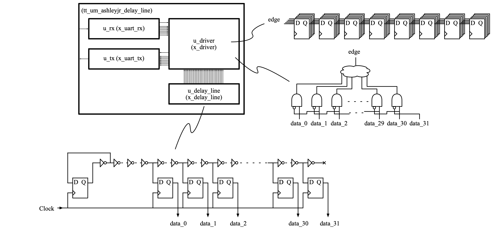

  

# tt04-delay-line

This project is part of [TinyTapeout4](https://github.com/TinyTapeout/tt04-submission-template)

- A delay line output changes based on time delay of different variables such as process, voltage and temperature.

- There are may different delay line architectures.

   - https://springerplus.springeropen.com/articles/10.1186/s40064-016-2090-z. 

- This implementation is a simple tapped delay line.

- The continually changing data races through a chain of inverters.

- The chain is sampled at different stages to become a digital signal.

- An edge detection circuit is used find the rising which is then converted in a binary value.

- A bank of flops is used to sample 8 sequential rising edge values.

## Test

- https://github.com/ashleyjr/tt04-delay-line/src/test/silicon_test.py

   - This python script uses pyserial to run a set of tests on the design

   - python3 silicon_test.py --help

- UART

   - The UART is the only interface to the design
   
      - 115200 baud
      
      - Least significant bit first
      
      - 1 Start bit
      
      - 8 Data bits
      
      - No parity bit
      
      - 1 Stop bit
      
      - Taken from https://github.com/ashleyjr/rtl-uart
      
      - The bottom 4 bits [3:0] of the UART frame make up the command
   
   - 4'h0: Shift In
   
      - Shift the top 4 bits [7:4] of the frame in to memory
      
      - The memory is shifted 4 places to the left
      
      - The data is placed in to the bottom 4 bits [3:0]
      
      - This command is to test the silicon and debug software
   
   - 4'h1: Shift Out
   
      - Shift the top 8 bits [39:32] of memory out to UART Tx
      
      - The memory is shifted 8 places to the left 
   
   - 4'h2: Full Sample
   
      - Take a full 32-bit sample from the delay line and place in memory
      
      - The sample is placed in to the bottom 32 bits [31:0]
      
      - The shift out command may be used to read the sample
   
   - 4'h3: Scope
   
      - Take 8 samples from the delay line at a 25MHz sample rate
   
      - These sample use the edge detection logic to find the position of the rising edge 
   
      - These samples are 5 bits wide
      
      - The samples are shifted in to the memory
      
      - Sample 0: [39:35]
      - Sample 1: [34:30]
      - Sample 2: [29:25]
      - Sample 3: [24:20]
      - Sample 4: [19:15]
      - Sample 5: [14:10]
      - Sample 6: [9:5]
      - Sample 7: [4:0]
      
      - The shift out command may be used to read the sample
   
   - 4'h4 to 4'hF inclusive
   
      - Ignored

## Expected performance 

## Compromises

- Clock Input

   - Ideally a clock signal would have been sent through the line to capture a new sample every cycle but this caused issues for timing analysis so the source data is sent from a flop.

- Length

   - Ideally the delay line would be longer to work at all process corners but as it stands the value is centred for *tt* and only just fits for *ss* and *ff*.

- Area available for sample memory

   - Ideally the sample memory would be a lot larger to take longer samples but only 8 samples are possible at 25MHz.
 

