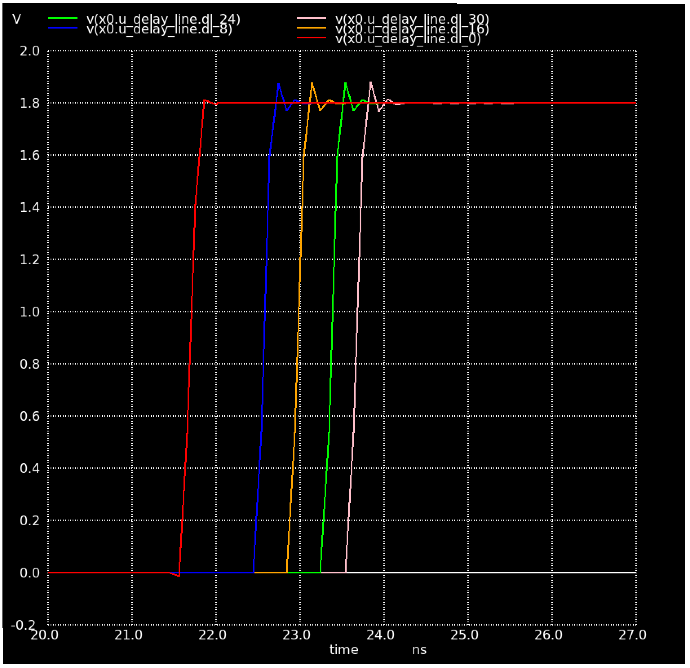
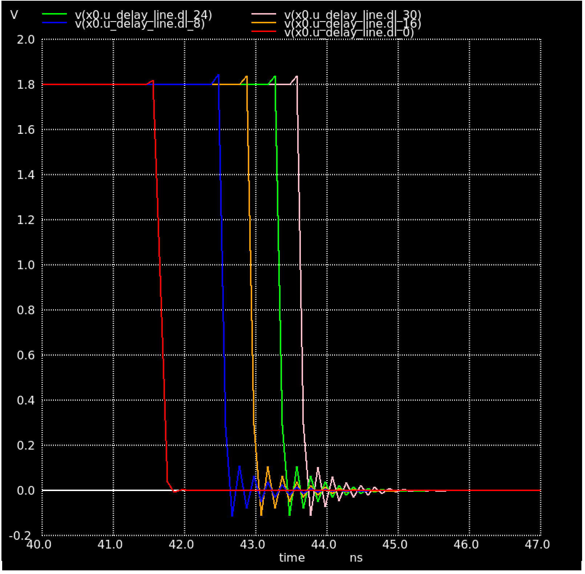
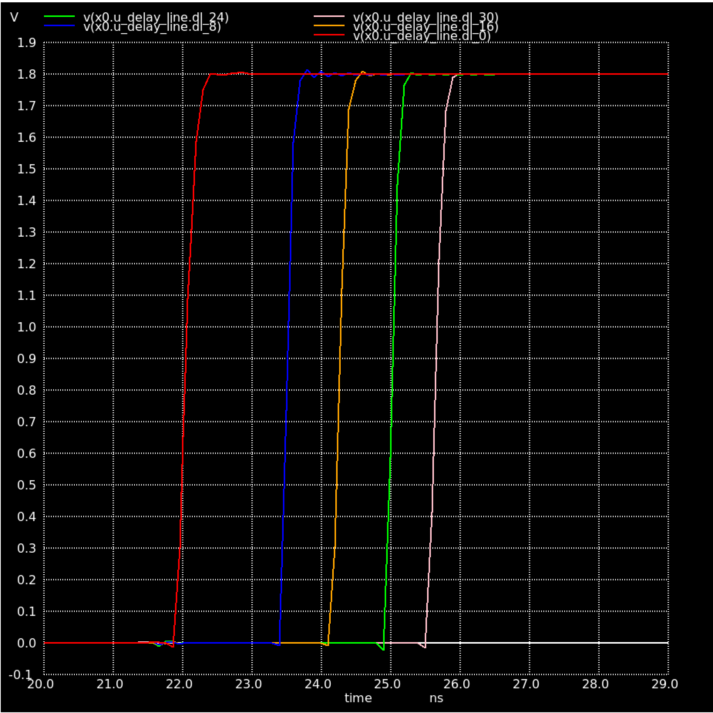

# Delay

- Seeing ~2ns to cross the entire delay lines, too short...

- With the parasitic extraction this increases to ~3.5ns 

- The simulation take x10 longer to run with parasticis extraction

