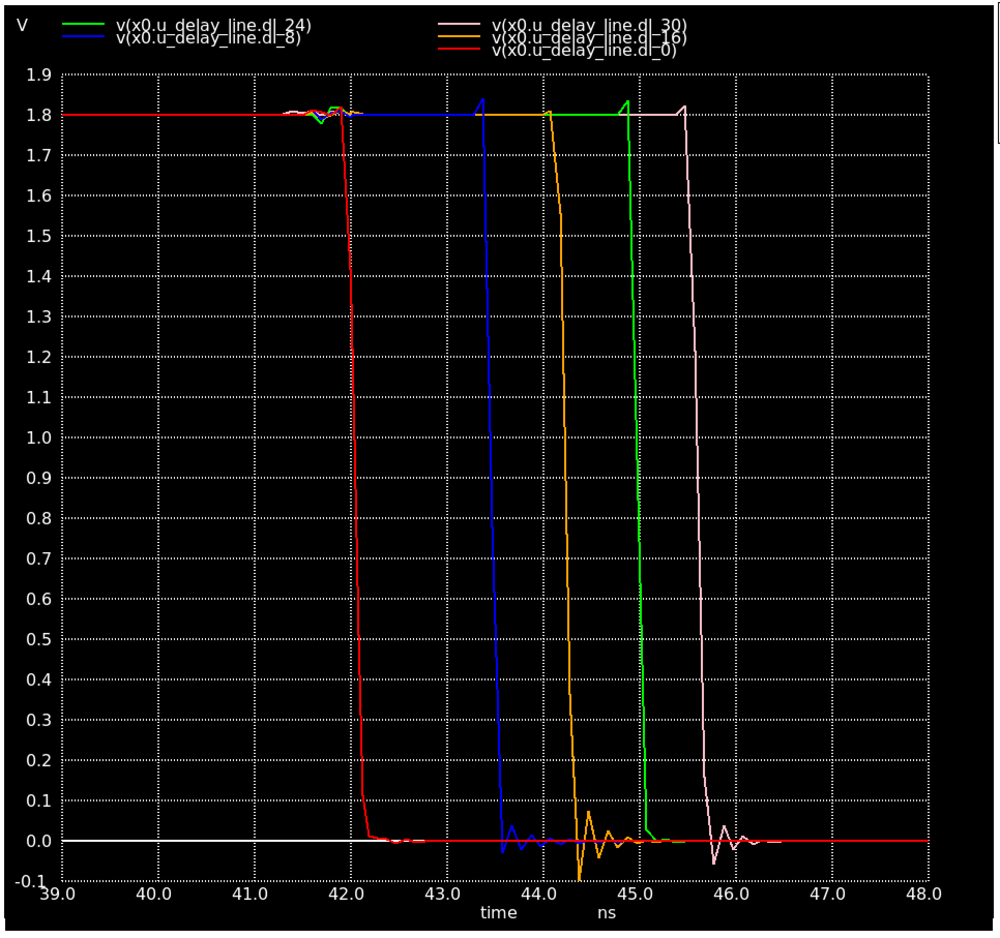

# Delay

- Seeing ~2ns to cross the entire delay lines, too short...

- With the parasitic extraction this increases to ~3.5ns 

- The simulation take x10 longer to run with parasitics extraction

- Increasing the number of inverters to 8 per stage still does 
  reach the rising edge of the next clock

- The names for the resync also gets squashed so might need more
  keep = true

