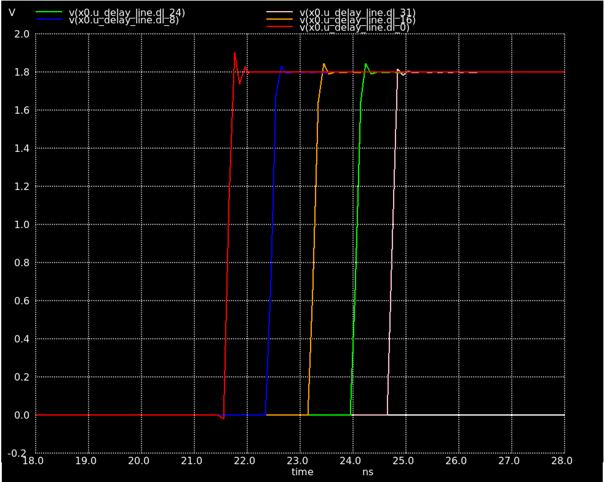
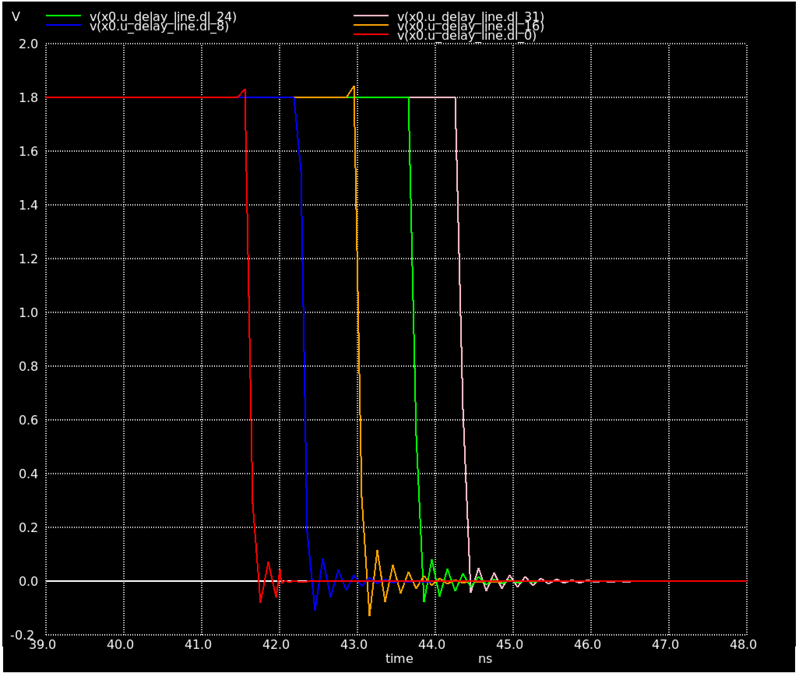
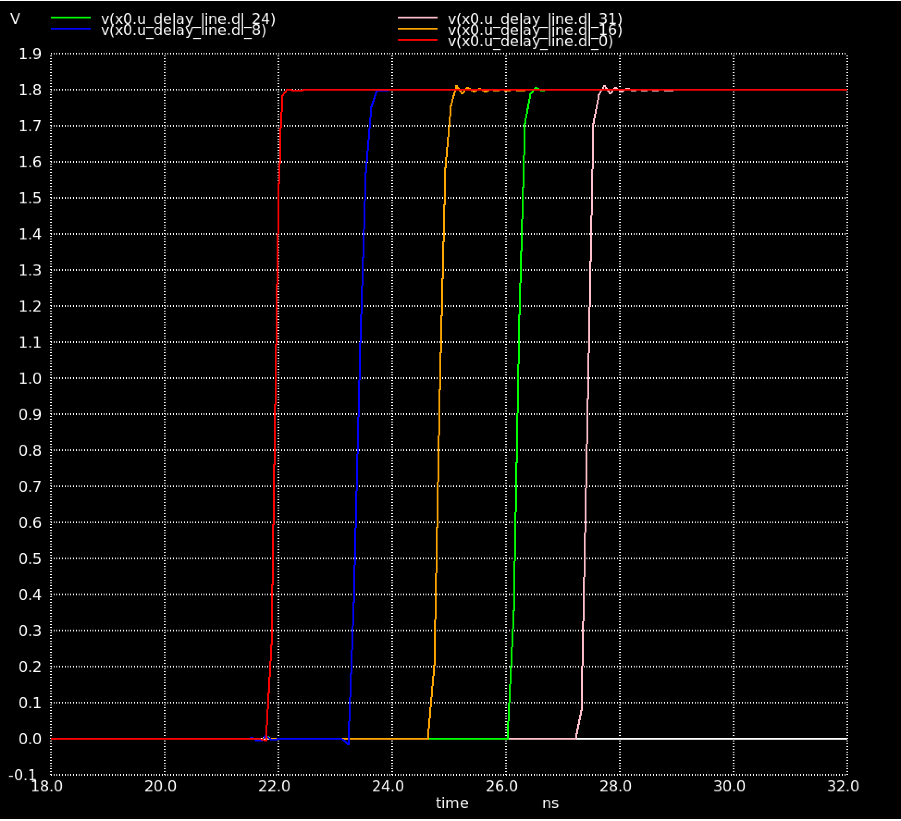
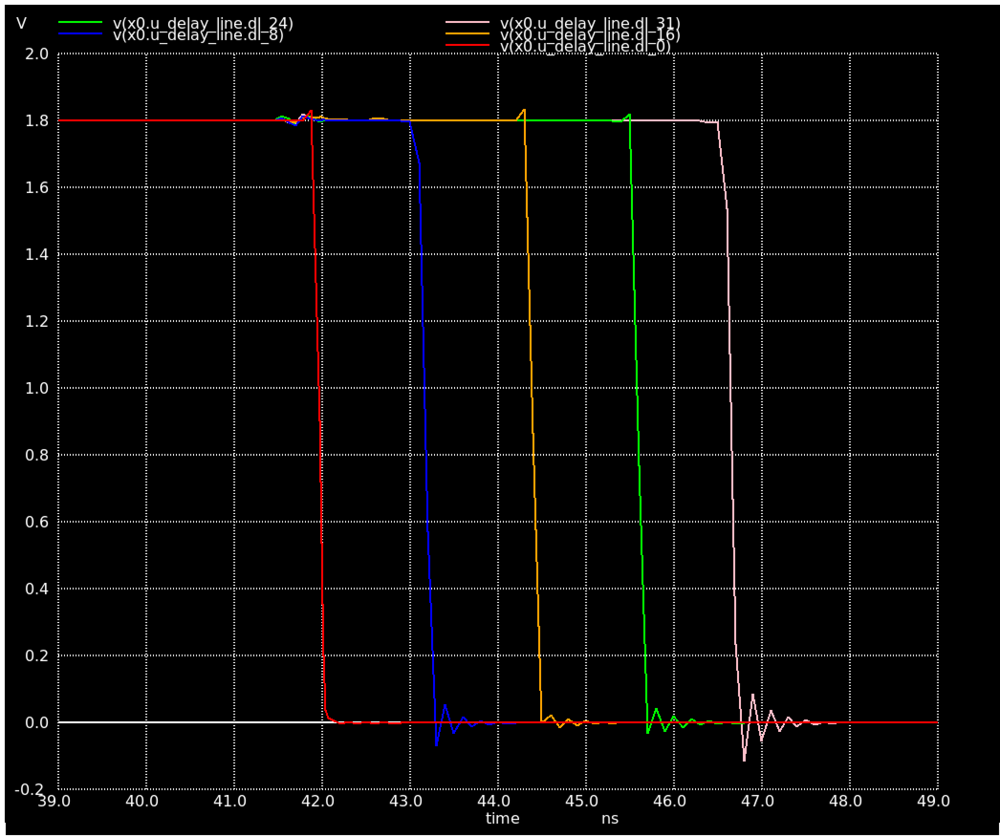
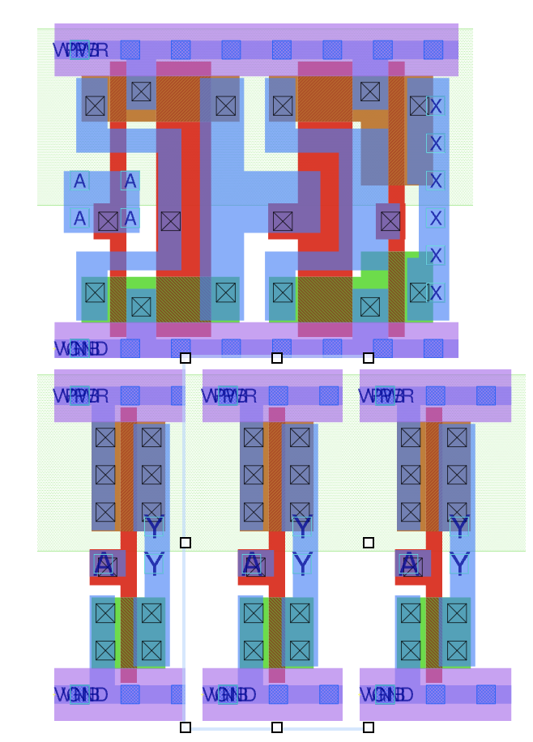

# Delay

- Seeing ~3ns to cross the entire delay lines when switching to sky130_fd_sc_hd__dlygate4sd3_1

- Guess the larger region of poly in the design increases the capactiance and therefore the delay 

- This delay increases to ~5.5ns when across the entire line when parasitics are included

- 32x1 inv: Utilisation 37.72%
- 32x8 inv: Utilisation 43.35%
- 32x1 delay gate: Utilisation 39.96%

- Looks like 3 sky130_fd_sc_hd__inv for 1 sky130_fd_sc_hd__dlygate4sd3
- Delay per cell of ~170ps sky130_fd_sc_hd__dlygate4sd3
- Delay per cell of ~100ps sky130_fd_sc_hd__inv

